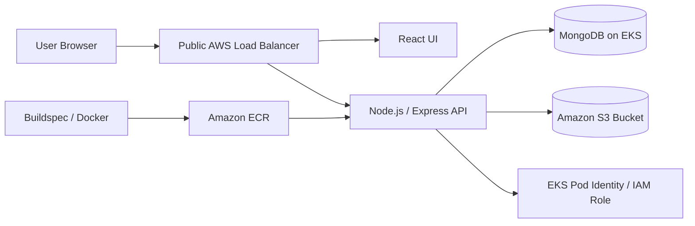
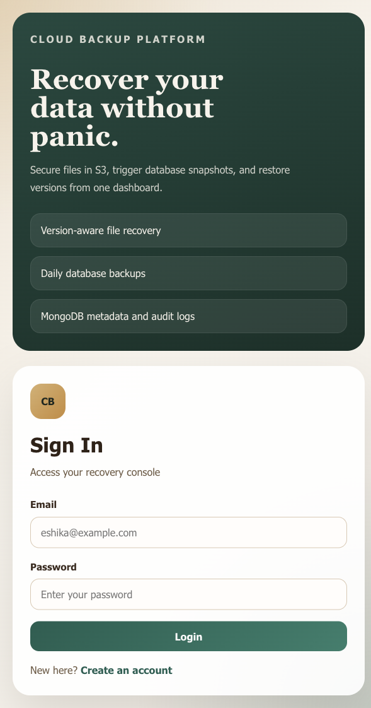
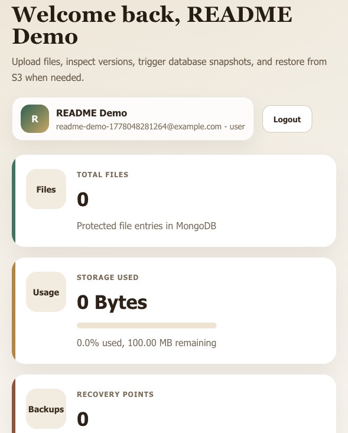

# Cloud Backup Recovery

Cloud Backup Recovery is an AWS-hosted file backup and recovery system. It lets users create accounts, log in, upload files, keep versions in Amazon S3, and restore older copies from a single dashboard. The app runs on Amazon EKS, uses Amazon ECR for container images, and stores metadata in MongoDB.

## What It Does

- User authentication with JWT
- File upload, download, and delete
- S3-backed file version history
- Database backup and restore workflow
- MongoDB metadata tracking for files, users, logs, and recovery points

## Deployment

The project is deployed on AWS with the following pieces:

- Amazon EKS cluster: `cloud-backup-eks`
- Amazon ECR image: `001961766026.dkr.ecr.ap-south-1.amazonaws.com/cloud-backup-recovery:latest`
- Public app endpoint: `http://ab9f32fec276d450a9724384147bcd81-1415855032.ap-south-1.elb.amazonaws.com`
- S3 bucket: `cloudbackuprecovery-simple-001961766026-20260505`
- MongoDB: running inside the EKS cluster
- Service account: `cloud-backup-app` with EKS pod identity and IAM role access

## High-Level Architecture

## Workflow

1. User opens the public AWS load balancer URL.
2. User signs up or logs in.
3. User uploads a file or triggers a backup action.
4. The backend stores the file in S3 and saves metadata in MongoDB.
5. Every re-upload of the same file creates a new recoverable version.
6. Users can download the latest version or restore an older one.
7. Startup checks keep bucket versioning enabled and the backup cron runs in the background.

## Screenshots

### Login / Landing

### Dashboard

## Useful Links

- Live app: `http://ab9f32fec276d450a9724384147bcd81-1415855032.ap-south-1.elb.amazonaws.com`
- EKS cluster: `cloud-backup-eks`
- Test / access guide: `QUICK_START.md`
- EKS test report: `EKS_TEST_REPORT.md`

